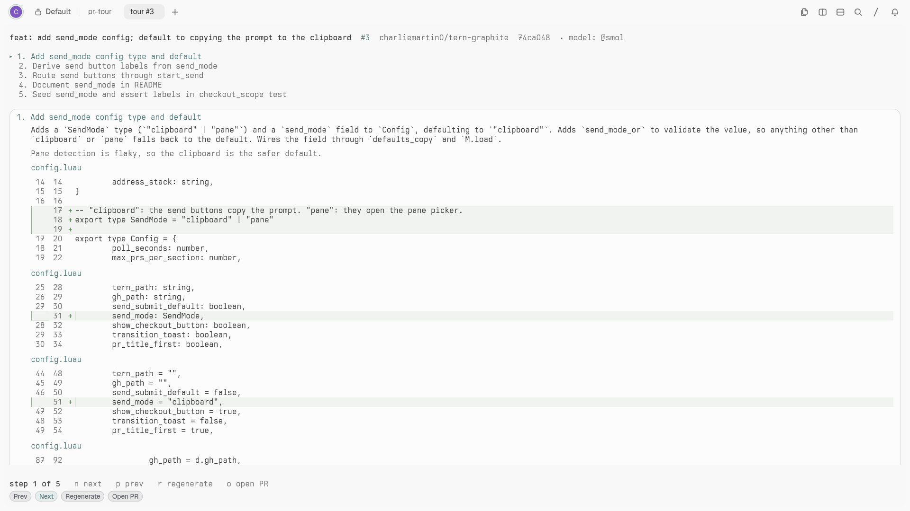
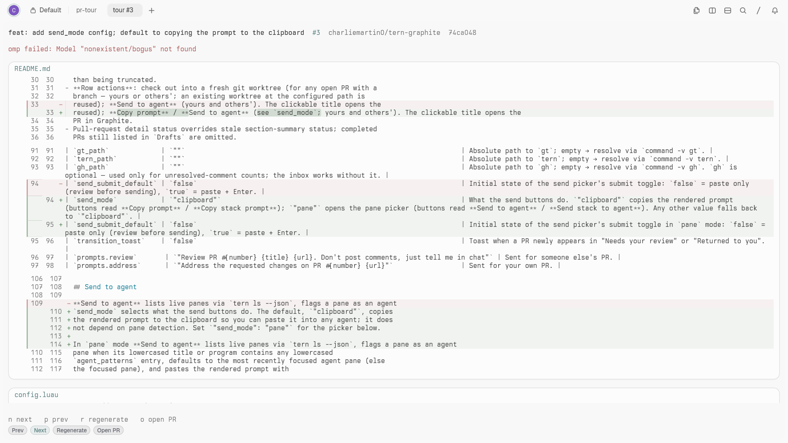

# pr-tour

A Tern block that shows a pull request's diff as a guided tour. `gh` fetches
the diff, `omp` groups the hunks into logical steps with a **what** and a
**why** above each step's hunks, and the result is cached per PR head so
reopening a PR never calls the model again. If the model fails, the block
shows the plain diff by file instead.




## Requirements

- Tern 0.6.0 or newer.
- [`gh`](https://cli.github.com), signed in (`gh auth login`). Whatever account
  is active is used; no account switching.
- [`omp`](https://github.com/can1357/oh-my-pi) on the same machine, with a
  working model for the configured `model` selector.

## Install

```sh
tern plugin link ~/Dev/tern-plugins/pr-tour
```

## Use

- From the **graphite** plugin: the **Diff** button on any PR row opens
  `pr-tour.tour` in a new tab (graphite ≥ 0.4.0; see its README).
- Directly: open the block kind `pr-tour.tour` with arguments
  `<owner/repo> <number> [sha] [title]`, e.g. `charliemartin0/tern-graphite 3`.

The header shows the PR title, number, repo, short head sha and where the tour
came from: `model: @smol` for a fresh run, `cached` for a cache hit. Below it is
a numbered step index (the current step highlighted) and the current step: its
title, **what** (one or two sentences), **why** (muted; `why: not stated in the
PR` when neither the PR text nor the code gives a reason), then each hunk under
its file path as a diff. A final **Not toured** section lists skipped files and
why (binary, lockfile/generated glob, `@generated` / `<auto-generated` marker,
no textual changes, or over `max_diff_lines`).

### Keys

| Key | Action |
|-----|--------|
| `n` / `p` | next / previous step (also the **Next** / **Prev** badges) |
| `r` | regenerate: fetch again and call the model, ignoring the cache |
| `o` | open the PR on GitHub |

## Config

`config.json` in the plugin data dir (`tern.plugin.data`) is created with the
defaults on first run and re-read on every open and on `r`. Invalid JSON falls
back to defaults and shows the error in the header; a wrong-typed key falls
back per key.

| Key | Default | Meaning |
|-----|---------|---------|
| `model` | `"@smol"` | Passed to `omp --model`. Role aliases such as `@smol` and concrete selectors both work. |
| `timeout_s` | `90` | Kill `omp` after this many seconds and fall back to the plain diff. Must be > 0. |
| `max_diff_lines` | `3000` | Cap on hunk lines sent to the model. Files are toured in diff order until the cap; the first file is always toured. The header says how many files were toured. Must be > 0. |
| `skip_globs` | lockfiles, `*.min.*`, `*.map`, `*.snap`, `**/generated/**`, `*.g.cs`, `*.Designer.cs`, `*.pb.go`, `dist/**` | Files matching any glob (full path or basename; `**` crosses `/`, `*` does not) are not toured. A list of strings or the default list. |
| `gh_path` | `""` | Absolute path to `gh`; empty resolves `command -v gh` through a login shell. |
| `omp_path` | `""` | Absolute path to `omp`; empty resolves `command -v omp` through a login shell. |

## Cache

`$XDG_CACHE_HOME/tern-pr-tour/` (default `~/.cache/tern-pr-tour/`), one file per
PR head: `<owner>_<repo>__<number>__<sha>.json` holding the model, the
validated steps and a timestamp. A new push changes the head sha, so it gets a
fresh tour; `r` forces a new one for the same sha. Failed runs are never
cached. Delete the directory to clear everything.

## How the model is used

One `omp -p --no-tools --no-session --mode text --model <model> @prompt.md`
call per tour. The prompt carries the PR title, body, commit messages and every
toured hunk with an id (`f<file>h<hunk>`). The answer must be JSON; the plugin
extracts the outermost `{…}` and repairs it so every hunk id appears exactly
once: unknown ids are dropped, repeats keep their first step, forgotten hunks
land in a final **Other changes** step. An answer with no usable step at all
(for example all-unknown ids) counts as a failure, shows the error, and is not
cached.

## Fallback

`gh` failures (not signed in, no access, PR not found) show `gh: <first stderr
line>`; a `gh` or `omp` that cannot be started at all shows the spawn error with
the same prefix. `omp` failures show `omp failed: <first stderr line>`, `tour generation
timed out after <n>s`, or `model returned invalid JSON: <reason>`. In all cases
the toured files are listed as a plain diff, one card per file.

## Testing

```sh
# Pure logic (diff parser, filters, prompt, validation) — needs the Luau CLI:
LUAU=/path/to/luau bash test/unit.sh

# Real Tern window, private daemon/state/cache, fake gh and omp (needs tern and jq):
bash test/e2e.sh
```

`test/e2e.sh` links only this plugin in a private config dir and drives six
scenarios: fresh tour (cache written, one model call), cached reopen (no model
call), `r` regenerate (second call), failing model (error line + plain diff),
and an `omp` / `gh` path that cannot be spawned (error line, no stuck spinner).
The window it opens is a real one (`tern serve` loads only fixture plugins).

Screenshots: both come from a real window against the public PR
`charliemartin0/tern-graphite#3` with real `gh` and `omp`; `fallback.png` uses
`model = "nonexistent/bogus"`. A `tern ctl shot` re-initialises blocks right
after it captures, so take one shot per fresh state.
